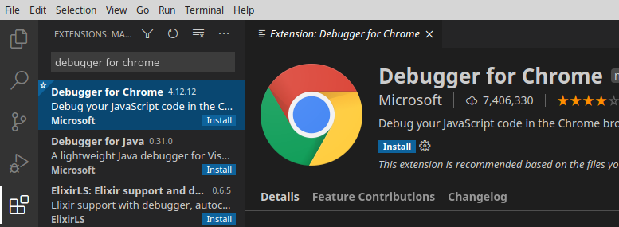

# electron-typescript-vscode

This project provides a minimal working example of how to set up Visual Studio Code to develop an Electron app in Typescript, including debug support.

Visual Studio Code comes with Electron support and Typescript support out of the box, but bringing the two together requires some knowledge of the available configuration options that beginners may not have. This repository contains a Visual Studio Code project with the bare minimum configuration to show how Visual Studio Code, Node, Electron and Typescript must be configured to work together.

The latest example has been created and tested on Linux with 
- Node v15.11.0
- Electron v12.0.0
- Typescript v4.2.3
- Visual Studio Code v1.54.1
- Debugger for Chrome extension v4.12.12

## Install application
```sh
# Clone repository
git clone https://github.com/abartho/electron-typescript-vscode.git

# Change into directory
cd electron-typescript-vscode

# Install dependencies
npm install

# Optional: test if the application is running
npm start
```

## Set up Visual Studio Code and start debugging

1) Install the "Debugger for Chrome" extension. 

    It is required for debugging renderer processes.

    

1) In the Run view, select the "Electron: All" configuration. 
    
    This is a compound configuration that will start both the "Electron: Main" and "Electron: Renderer" configurations.
    
    
    
1) Set a breakpoint in `src/main.ts` and `src/renderer.ts`

1) Run the "Run" -> "Start Debugging" command (<kbd>F5</kbd>)
- The breakpoint in the `main.ts` will be hit.
- Click Continue (<kbd>F5</kbd>)
- In the Electron example app, click the "Turn page red" button.
- The breakpoint in `renderer.ts` should be hit.
  
- If the breakpoint is not hit and marked as unbound instead:
  
     
     you have likely come across a bug in the new JavaScript debugger for Node.js and Chrome, which is currently in preview and enabled by default. It is used by recent versions of the "Debugger for Chrome" extension. Disabling the preview debugger will solve the problem (https://github.com/microsoft/vscode/issues/102493).
  - Open Settings (<kbd>Ctrl+,</kbd>)
  - Search for `debug.javascript.usePreview`
  - Set option to false
  
  - Run the "Electron: All" configuration again


## How does it work?

Electron has two kinds of processes: a main process and renderer processes (one for each tab). They need different launch configurations, which are shown below. The code snippets are taken from the [launch configuration](.vscode/launch.json).

### Main process
The main process can be debugged with the pwa-node debugger that ships with Visual Studio Code.

The launch configuration looks like this:

```jsonc
{
  "name": "Electron: Main",
  "type": "pwa-node",               //use the node debugger that comes with   VS Code
  "request": "launch",
  "cwd": "${workspaceFolder}",
  "runtimeExecutable": "${workspaceFolder}/node_modules/.bin/electron",
  "runtimeArgs": [
    "--remote-debugging-port=9223"  //open debugging port for renderer process
  ],
  "args" : ["."],
  "outputCapture": "std",
  "sourceMaps": true,
  "resolveSourceMapLocations": [
    "${workspaceFolder}/**",        //use source maps for files in workspace folder
    "!**/node_modules/**"           //but ignore everything in the node_modules folder
  ],
  "preLaunchTask": "npm: compile"   //recompile before debugging (execute the compile script defined in package.json)
}
```
In the `sourceMaps` and `resolveSourceMapLocations` sections, we enable the creation of source maps for our code. Source maps must be generated to enable the debugger to map locations inside the JavaScript code back to TypeScript.

In the `runtimeArgs` section, we open a port for the renderer process. There is a counterpart defined in the renderer process configuration as shown below. 

### Renderer process
Debugging a renderer process requires the "Debugger for Chrome" extension.

```jsonc
{
  "name": "Electron: Renderer",
  "type": "chrome",       //use the Debugger for Chrome (extension)
  "request": "attach",
  "port": 9223,           //use debug port opened in Electron: Main configuration
  "webRoot": "${workspaceFolder}",
  "timeout": 30000
}
```
In the `port` section, we specify the debugging port that we chose in the main process configuration.

### Compound configuration
Visual Studio Code can only run a single configuration at a time, but we need to run the Main and the Renderer configurations at the same time. The solution are compound configurations (found in [vscode-recipes](https://github.com/Microsoft/vscode-recipes/tree/master/Electron))

```jsonc
"compounds": [ //launch multiple configurations concurrently
  {
    "name": "Electron: All",
    "configurations": [
      "Electron: Main",
      "Electron: Renderer"
    ]
  }
]
```